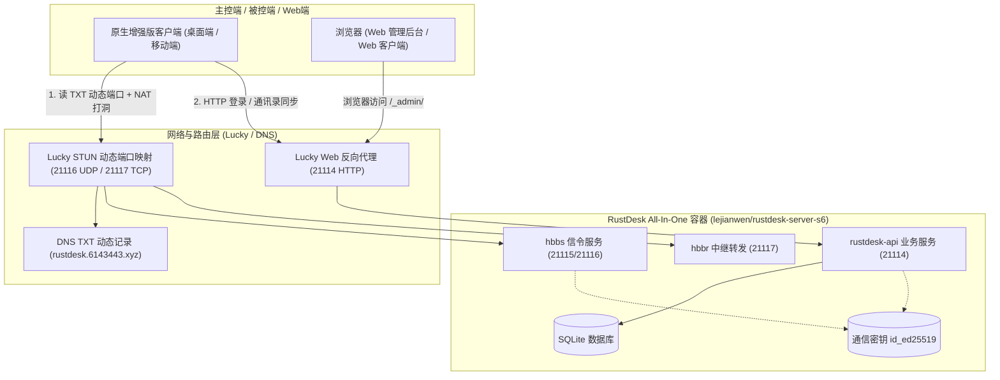

# RustDesk All-In-One (API + Web 控制台 + 动态 STUN/DNS TXT) 部署与配置指南

本文档专为域名 **`rustdesk.6143443.xyz`**、存储路径 **`/vol2/1000/docker-data/rustdesk`** 以及 **动态 STUN 端口（Lucky / DNS TXT 记录）** 场景量身定制，涵盖 Docker Compose 容器编排、Web 后台初始化、通信公钥提取以及多端客户端通讯录同步的完整落地流程。

---

## 目录
- [一、架构总览与工作模式](#一架构总览与工作模式)
- [二、端口映射与网络规划](#二端口映射与网络规划)
- [三、Docker Compose 完整配置](#三docker-compose-完整配置)
- [四、一键启动与初始化步骤](#四一键启动与初始化步骤)
- [五、Web 管理后台控制台使用](#五web-管理后台控制台使用)
- [六、RustDesk 增强版客户端配置](#六rustdesk-增强版客户端配置)
- [七、核心疑问解答与排错指南](#七核心疑问解答与排错指南)

---

## 一、架构总览与工作模式

本方案采用 `lejianwen/rustdesk-server-s6:latest` 多合一镜像，通过 s6 进程守护在单个容器内同时运行三大核心模块：



- **信令与中继（hbbs / hbbr）**：监听标准端口，通过 Lucky 进行 STUN 动态穿透，并将外网动态端口写入 DNS TXT 记录。
- **业务 API 与 Web 控制台（rustdesk-api）**：监听 21114 端口，提供标准 HTTP RESTful 接口与浏览器端管理界面。
- **增强版客户端**：自动查询并解析 DNS TXT 动态端口实现 P2P 直连，同时连接 21114 端口实现账号登录与多端通讯录实时双向同步。

---

## 二、端口映射与网络规划

| 容器内端口 | 协议 | 对应服务 | 外部暴露与映射方式 |
| :--- | :--- | :--- | :--- |
| **21114** | TCP | HTTP API & Web 管理后台 | **关键**：通过 Lucky Web 反代或固定端口暴露，外网访问 `/_admin/` |
| **21115** | TCP | NAT 类型探测 | 局域网/内网测试使用，一般不需要单独映射到公网 |
| **21116** | TCP | 信令握手连接 | Lucky STUN 映射为动态 TCP 端口 |
| **21116** | **UDP** | 信令注册 & STUN 打洞穿透 | **核心**：Lucky STUN 映射为动态 UDP 端口，写入 DNS TXT |
| **21117** | TCP | 数据中继服务 | Lucky STUN 映射为动态 TCP 端口，写入 DNS TXT |
| **21118** | TCP | Web 客户端 WebSocket (可选) | 网页端远控信令代理（需要时映射） |
| **21119** | TCP | Web 客户端中继 WebSocket (可选) | 网页端远控数据中继（需要时映射） |

---

## 三、Docker Compose 完整配置

将以下内容保存为 `/vol2/1000/docker-data/rustdesk/docker-compose.yml`：

```yaml
version: '3.8'

networks:
  rustdesk-net:
    driver: bridge

services:
  rustdesk:
    image: lejianwen/rustdesk-server-s6:latest
    container_name: rustdesk-server
    restart: unless-stopped
    ports:
      - "21114:21114"      # HTTP API & Web 控制台后台
      - "21115:21115"      # NAT 类型探测 (TCP)
      - "21116:21116"      # 信令注册 (TCP)
      - "21116:21116/udp"  # 信令注册 & STUN 穿透 (UDP) —— 必须开启
      - "21117:21117"      # 中继转发服务 (TCP)
      - "21118:21118"      # Web 客户端 WebSocket (可选)
      - "21119:21119"      # Web 客户端中继 WebSocket (可选)
    environment:
      # 1. 默认下发的中继地址（客户端若匹配到 DNS TXT，会优先自动提取 TXT 内的动态 relay 端口）
      - RELAY=rustdesk.6143443.xyz:21117
      # 开启加密通信通道
      - ENCRYPTED_ONLY=1
      # 2. 强制登录：建议初次部署设为 N，待网页端创建用户并测试通过后再改为 Y
      - MUST_LOGIN=N
      - TZ=Asia/Shanghai

      # 3. 内部服务与前端交互绑定
      - RUSTDESK_API_RUSTDESK_ID_SERVER=rustdesk.6143443.xyz:21116
      - RUSTDESK_API_RUSTDESK_RELAY_SERVER=rustdesk.6143443.xyz:21117
      # 外部访问 Web 控制台与 API 接口的完整 URL（若通过 Lucky 反代或修改了外网端口，请对应修改）
      - RUSTDESK_API_RUSTDESK_API_SERVER=http://rustdesk.6143443.xyz:21114
      # 容器内公钥文件路径（指向挂载到 /data 的 id_ed25519.pub）
      - RUSTDESK_API_KEY_FILE=/data/id_ed25519.pub
      # 4. JWT 鉴权密钥（可自行替换为 32 位随机字符）
      - RUSTDESK_API_JWT_KEY=7c9b8e21a4f0d635c2e1987ba45e6f3d
    volumes:
      # 宿主机数据持久化挂载
      - /vol2/1000/docker-data/rustdesk/server:/data     # 存放服务通信密钥及 hbbs 数据
      - /vol2/1000/docker-data/rustdesk/api:/app/data   # 存放 SQLite 数据库及 Web 后台配置
    networks:
      - rustdesk-net
```

---

## 四、一键启动与初始化步骤

### 1. 建立挂载目录并启动容器
```bash
# 创建持久化存储目录
mkdir -p /vol2/1000/docker-data/rustdesk/server
mkdir -p /vol2/1000/docker-data/rustdesk/api

# 进入目录并后台运行
cd /vol2/1000/docker-data/rustdesk
docker compose up -d
```

### 2. 获取 Web 控制台管理员初始密码
容器首次启动时，会在日志中打印自动生成的 `admin` 初始随机密码：
```bash
docker logs rustdesk-server | grep -i password
```
*如输出包含：`admin password: Xy7z...`，请记录下该初始密码。*

### 3. 获取服务端通信公钥（Key）
公钥会在容器启动后自动在 `/data` 下生成：
```bash
cat /vol2/1000/docker-data/rustdesk/server/id_ed25519.pub
```
*终端打印出的长字符串即为通信公钥（Key），客户端配置时必须填入。*

---

## 五、Web 管理后台控制台使用

1. **登录后台**：
   - 打开浏览器，访问：`http://rustdesk.6143443.xyz:21114/_admin/`（或 Lucky 反代后的实际 URL）
   - 用户名：`admin`
   - 密码：刚才在日志中提取到的初始随机密码
2. **安全设置**：
   - 首次登录后，点击右上角个人头像，立即修改管理员登录密码。
3. **用户管理与设备授权**：
   - 点击左侧菜单的 **“用户管理”**，添加日常使用的常规账号；
   - 可以为不同用户分配地址簿标签、设备访问权限以及最大并发连接数。

---

## 六、RustDesk 增强版客户端配置

在电脑或手机上打开安装好的增强版 RustDesk 客户端：

### 1. 服务器网络配置
进入 **设置 -> 网络 -> ID/中继服务器**（点击卡片右侧齿轮或列表项）：

| 配置项 | 填写内容 | 作用与机制 |
| :--- | :--- | :--- |
| **Profile Name** | `Home-STUN`（自定义别名） | 用于在顶部连接状态栏清晰显示当前走的是哪条线路 |
| **ID Server** | `rustdesk.6143443.xyz` | 增强版会自动读取 DNS TXT 记录提取外部动态端口并执行 STUN 穿透 |
| **Relay Server** | `rustdesk.6143443.xyz` | 中继服务器地址（同样联动动态端口） |
| **API Server** | `http://rustdesk.6143443.xyz:21114` | 填写 rustdesk-api 地址，用于账号认证与通讯录同步 |
| **Key** | 刚才提取的 `id_ed25519.pub` 公钥内容 | 加密会话密钥 |

点击 **“确定”** 保存生效。

### 2. 登录账号与通讯录同步
1. 点击客户端左侧导航栏的 **“账户 (Account)”** 图标；
2. 输入在 Web 管理后台创建的用户名与密码，点击 **登录**；
3. 登录成功后：
   - 点击左侧 **“地址簿 (Address Book)”**：服务器上绑定的所有被控端设备、分组与别名将瞬间自动加载显示；
   - 在本机添加、重命名、打标签的设备也会实时双向同步回云端数据库；
   - 点击地址簿中的任意设备发起远程控制，客户端将自动使用 STUN 动态端口进行端到端 P2P 穿透，顶部锁形图标悬浮时将直观显示 `Home-STUN` 线路。

---

## 七、核心疑问解答与排错指南

### Q1: 既然我的 21116 和 21117 是动态 STUN 端口，Web 控制台 21114 该怎么让外网访问？
- **解答**：浏览器不像我们的增强客户端那样能够解析自定义的 DNS TXT 记录去寻找动态端口。因此 **21114 必须拥有固定的访问入口**。
- **解决策略**：
  1. **通过 Lucky Web 反向代理（最推荐）**：在 Lucky 的 Web 规则中将内网 `127.0.0.1:21114` 反代出来，绑定域名并申请免费 Let's Encrypt SSL 证书（走 HTTPS 443 或固定端口）；
  2. **IPv6 直通**：若家庭宽带有 IPv6，可通过 DDNS 将 AAAA 记录解析到宿主机，外网直接使用 `http://[IPv6]:21114` 访问。

### Q2: 浏览器可以直接打开网页版远程桌面控制别的电脑吗？
- **解答**：可以，但有网络协议限制。
- 网页端（Web Client）运行在浏览器沙箱内，受 Web 标准限制**无法发送裸 UDP 包执行 STUN NAT 打洞**，因此网页端远程控制**必须通过 WebSocket/TCP 走中继转发（hbbr 21117/21119）**。
- 如果追求最高性能、最低延迟的动态 STUN P2P 端到端直连，**建议始终使用我们的跨平台增强版原生客户端**。

### Q3: 什么时候可以开启 `MUST_LOGIN=Y`？
- 容器初次部署时请务必保持 `MUST_LOGIN=N`，确保新机器可以在未登录状态下注册上报 ID。
- 等到所有被控端都已绑定至 Web 控制台的设备列表、且主控端都已登录对应账号后，可将 `MUST_LOGIN` 修改为 `Y` 并运行 `docker compose up -d`，此时任何未认证的陌生客户端都将被拒绝连接，安全性达到最高。
